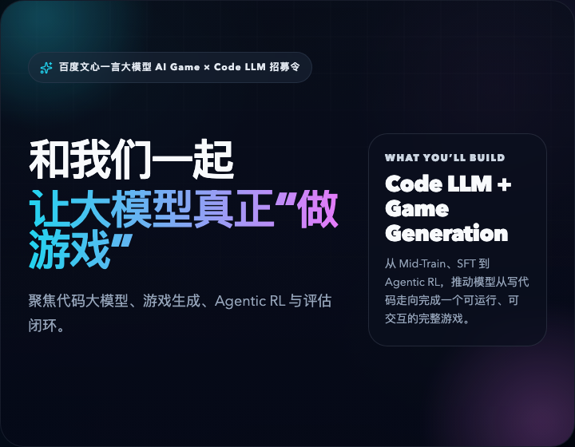

# 百度文心一言大模型 AI Game × Code LLM 招募令

[访问招聘主页](https://aiforgame.github.io/)

我们正在打造下一代「代码大模型 + 游戏生成」能力。

我们的目标不是让模型只会补全几段代码，也不是做几个演示性质的 demo，而是让模型真正具备从 0 到 1 构建完整游戏世界的能力: 能理解规则、使用引擎、组织交互、完成调试，并最终生成一个可运行、可体验、可迭代的游戏。

如果你对大模型、Agent、代码生成、游戏生成、训练与评估闭环这些问题有长期兴趣，这里会是一个足够难、也足够有意思的方向。

## 我们在做什么

- 打造真正会“做游戏”的 Code LLM，而不只是会写片段代码的模型
- 打通从 Mid-Train、SFT 到 Agentic RL 的完整能力链路
- 构建高质量游戏开发数据，让模型学会引擎、渲染、物理和交互逻辑
- 建立“好游戏”的评估体系，形成从数据、训练到评估、优化的闭环
- 推进 Agent scaffold 与 tooling，让模型尽可能独立地完成完整游戏生成

## 你将参与的事情

- 打造会“写游戏”的大模型
- 构建游戏开发数据宇宙
- 定义“好游戏”的评判标准
- 让 Agent 真正能“做完一个游戏”

## 我们希望你是

- 硕士及以上，CS / AI / ML 等相关背景
- 熟悉大模型训练或后训练流程，如 SFT、RL、数据构建，并且有实际经验
- 编程能力扎实，对系统和工程实现有感觉，不只是调用 API
- 深度使用过 AI Coding 工具，如 Claude Code、Codex、Cursor、Copilot 等
- 有第一性原理思维，愿意拆问题、重建方案，并把复杂事情真正做通

## 加分项

- 在 ACM / ICPC / NOI / IOI / Codeforces / TopCoder 等竞赛中有亮眼成绩
- 在 LLM / Agent / RL 方向有论文或有影响力项目
- 熟悉 Phaser、Three.js、Babylon.js 等游戏引擎或相关技术栈
- 做过游戏、小游戏、Canvas / WebGL 项目，哪怕是 side project

## 我们更看重什么

- 你有没有把一件复杂事情从 0 搞出来过
- 你是不是对“让 AI 真的 work”这件事有执念
- 你是否享受“调不通 → 打碎重来 → 最终跑通”的过程

## Why Us

- 这是一个真·前沿问题
- 很少有机会能同时参与数据、训练、评估、RL 的完整闭环
- 游戏是最复杂的代码生成落地场景之一
- 你会参与定义下一代模型能力和工作范式，而不是只做局部优化

## 投递方式

如果你对这个方向感兴趣，欢迎发送简历到:

[`lijingyao03@baidu.com`](mailto:lijingyao03@baidu.com)

